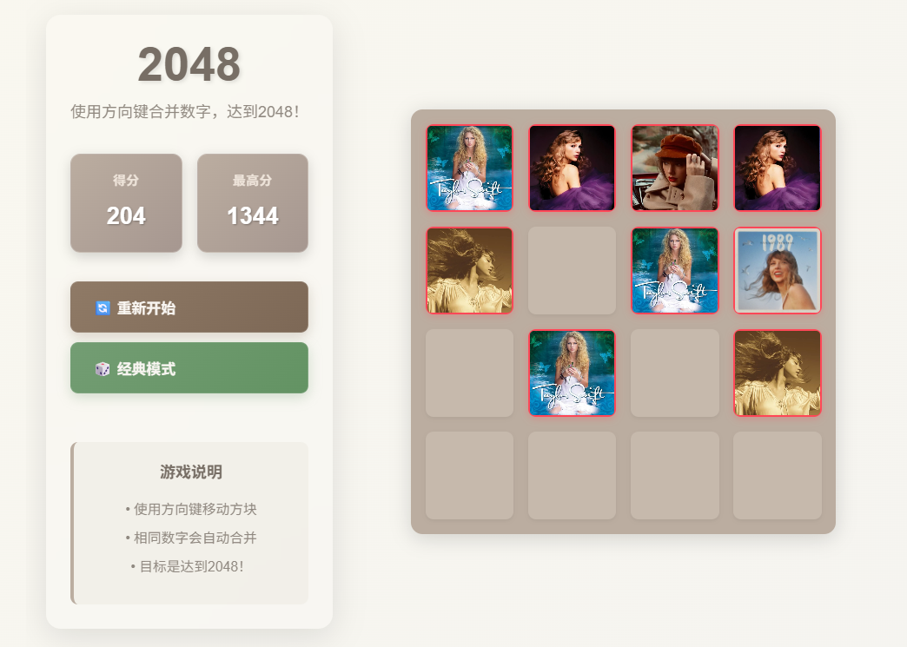
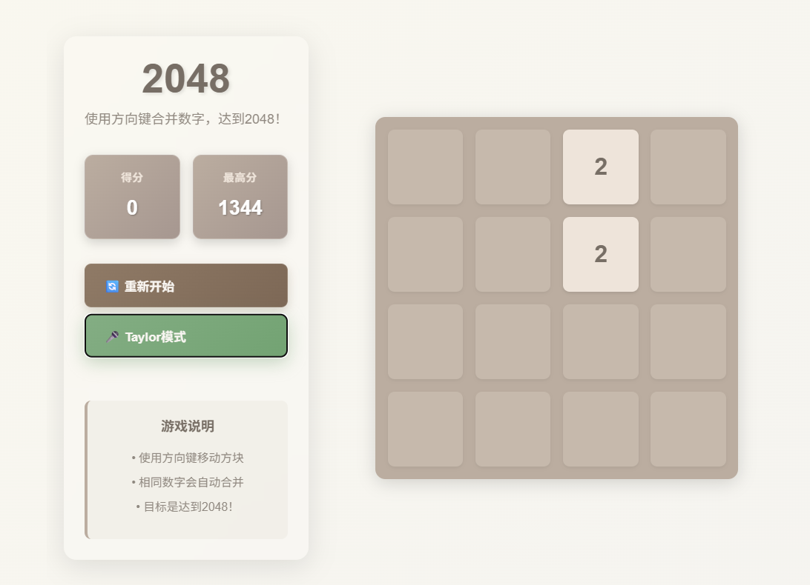

# 🎮 2048 Game - Vue3 Edition

一个基于 Vue3 + Vite 构建的现代化 2048 游戏，支持双主题切换，具有流畅的动画效果和响应式设计。

## 📱 游戏截图

### 经典数字模式


### Taylor 主题模式  


## ✨ 特性亮点

- 🎯 **正确的游戏逻辑** - 严格遵循标准2048规则，每次移动只能合并一次
- 🎨 **双主题支持** - 经典数字模式 ↔ Taylor图片主题
- 📱 **响应式设计** - 完美适配桌面端、平板和移动设备
- 🎭 **流畅动画** - 基于 motion-vue 的精美过渡效果
- ⌨️ **键盘控制** - 支持方向键操作
- 💾 **数据持久化** - 自动保存最高分记录
- 🎪 **无滚动条** - 沉浸式全屏游戏体验
- 🏗️ **现代化架构** - Vue3 Composition API + Vite

## 🎯 游戏规则

1. 使用 **方向键** 控制方块移动
2. 相同数字的方块会自动合并并翻倍
3. 每次移动后会随机生成新的方块 (90%概率是2，10%概率是4)
4. 目标是合并出 **2048** 方块
5. 当无法移动时游戏结束

## 🚀 快速开始

### 环境要求
- Node.js 16+ 
- npm 或 yarn

### 安装步骤

1. **克隆项目**
```bash
git clone https://github.com/yuyong123-lang/2048.git
cd 2048
```

2. **安装依赖**
```bash
npm install
```

3. **启动开发服务器**
```bash
npm run dev
```

4. **构建生产版本**
```bash
npm run build
```

## 🎮 游戏操作

| 操作 | 说明 |
|------|------|
| ⬅️ ➡️ ⬆️ ⬇️ | 方向键移动方块 |
| 🔄 重新开始 | 重置游戏状态 |
| 🎨 主题切换 | 经典模式 ↔ Taylor模式 |

## 🛠️ 技术栈

- **前端框架**: Vue 3
- **构建工具**: Vite
- **动画库**: @vueuse/motion  
- **样式**: CSS3 + Flexbox
- **状态管理**: Vue3 Composition API
- **开发语言**: JavaScript

## 📦 项目结构

```
2048/
├── public/                    # 静态资源
│   └── running_pictures/      # 运行截图
├── src/
│   ├── components/            # Vue 组件
│   │   ├── GameBoard.vue      # 游戏面板
│   │   ├── GameTile.vue       # 游戏方块
│   │   └── GameHeader.vue     # 游戏头部
│   ├── composables/           # 组合式函数
│   │   └── use2048.js         # 游戏核心逻辑
│   ├── assets/
│   │   └── taylor/            # Taylor主题图片
│   ├── App.vue                # 根组件
│   └── main.js                # 入口文件
├── package.json               # 项目配置
└── README.md                  # 项目文档
```

## 🎯 核心算法

### 移动合并逻辑
```javascript
function processRowLeft(row) {
  // 1. 移除所有的0
  const tiles = row.filter(val => val !== 0)
  
  // 2. 从左到右处理合并
  for (let i = 0; i < tiles.length - 1; i++) {
    if (tiles[i] === tiles[i + 1]) {
      tiles[i] *= 2        // 合并
      tiles[i + 1] = 0     // 标记已合并
    }
  }
  
  // 3. 再次移除0并补齐到4位
  const finalTiles = tiles.filter(val => val !== 0)
  while (finalTiles.length < 4) {
    finalTiles.push(0)
  }
  
  return finalTiles
}
```

## 🎨 主题系统

项目支持两种主题模式：

### 经典模式
- 传统数字显示
- 渐变色彩方案
- 清晰的数字字体

### Taylor 模式  
- 11张精美图片对应不同数值
- 个性化游戏体验
- 独特的视觉效果

## 🔧 自定义配置

### 添加新主题
1. 在 `src/assets/` 下创建主题文件夹
2. 准备对应数值的图片 (2, 4, 8, 16, 32, 64, 128, 256, 512, 1024, 2048)
3. 在 `GameTile.vue` 中添加新主题映射
4. 在主题切换逻辑中添加新选项

### 修改游戏规则
在 `src/composables/use2048.js` 中可以自定义：
- 初始方块数量
- 新方块生成概率
- 获胜条件
- 分数计算规则

## 🤝 贡献指南

欢迎提交 Issue 和 Pull Request！

1. Fork 本仓库
2. 创建特性分支: `git checkout -b feature/AmazingFeature`
3. 提交更改: `git commit -m 'Add some AmazingFeature'`
4. 推送分支: `git push origin feature/AmazingFeature`
5. 提交 Pull Request

## 📄 开源协议

本项目采用 MIT 协议 - 查看 [LICENSE](LICENSE) 文件了解详情

## 🙏 致谢

- 感谢 Vue.js 团队提供优秀的前端框架
- 感谢 Vite 提供快速的构建工具  
- 感谢 @vueuse/motion 提供流畅的动画效果
- 特别感谢 Claude Code 在开发过程中的协助

---

**🎮 Generated with [Claude Code](https://claude.ai/code)**

**⭐ 如果这个项目对你有帮助，请给个 Star！**
